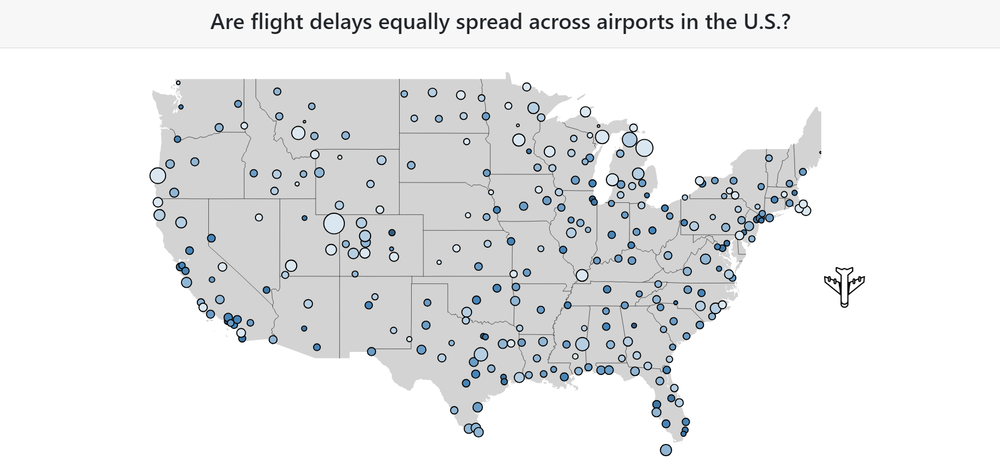
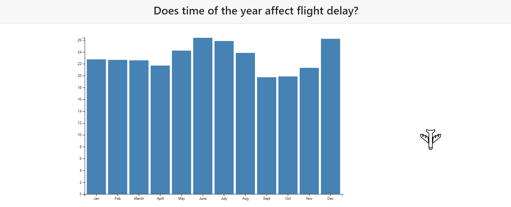
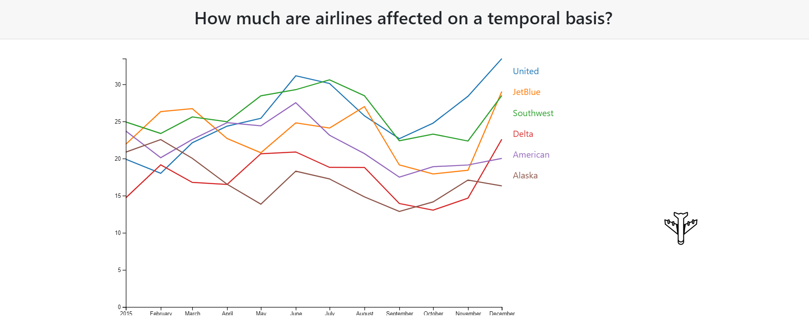
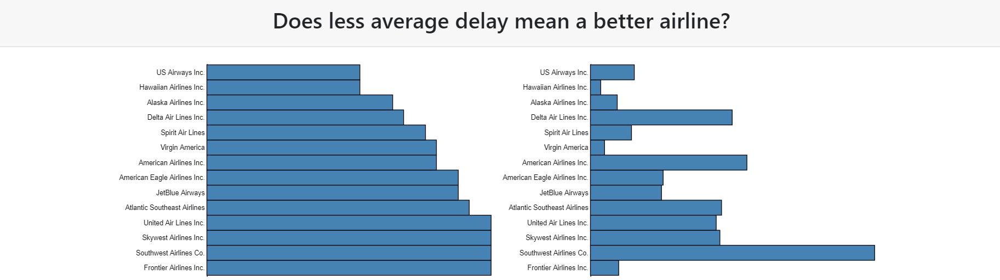

# Variability in Flight Delays
**Authors**: Dhaval Popat (dkp288), Ronak Thakkar (rht241 - online), Sameer Korlahalli (ssk698)

## About
Information Visualization Project (Group 13)

Variability in flight delays can be divided into various aspects such as temporal, regional, airlines etc. We aim to explore the variation of delays in some of these aspects to find out if any patterns exist because if they do, future research might possibly help in considerable reduction of delays. For example, there could be delays pertaining to outbound flights from one or a cluster of regions. We can find out individually the regions or the times during the year when least number of delays occur through the components of the dataset. We hence aim to explore if such patterns exist in the given dataset and communicate these results to the users.

* The circles represent airports present in the US.
* The size of circle represents average flight delay (in minutes) for a particular airport.
* The colour intensity of circle represents total number of daily flights (inbound and outbound) handled by a particular airport.

* The left graph in above visualization represents average flight delay of individual airlines sorted in ascending order.
* The right graph indicates total number of flights for the corresponding airline.

## More
[DEMO](https://nyu-vis-fall2018.github.io/timely-flights/)

[Project Description](project.pdf)
